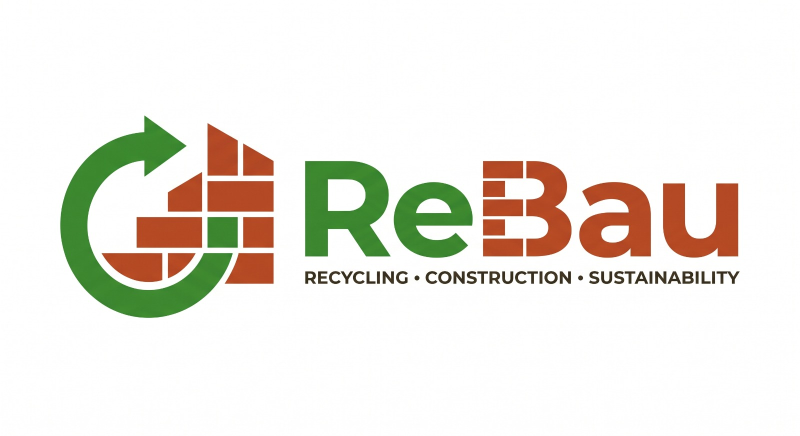

<div align="center">


**AI marketplace for reclaimed construction materials**

Scan it. Price it. Sell it. Half the cost, a fraction of the carbon.

🏆 **1st place** - AI Hackathon 2026 at FAU Erlangen-Nürnberg (Sustainability & Energy track)

[**Live demo**](https://vaibhavaher100.github.io/ReBau/) · [Pitch deck](./TeamToronto_ReBau.pptx) · [Event](https://www.linkedin.com/feed/update/urn:li:activity:7466127261474271232/)

</div>

## The problem

Germany discards about 12.9 million tonnes of reusable construction materials every year, roughly EUR 12 billion in value and 9 million tonnes of CO2. Usable steel, brick, and timber goes to landfill while the project next door buys the same material new at full price. The seller pays EUR 30-80 per tonne to throw value away; the buyer pays full price and full embodied carbon.

## What ReBau does

- **Sellers:** a site manager photographs a pile of leftover material on their phone. A vision LLM identifies what's in it, grades the condition, estimates the quantity, and prices it at roughly half the new price. One tap publishes it to the marketplace.
- **Buyers:** browse the marketplace, or upload a building plan / bill of materials. ReBau extracts the required materials, matches them against available used inventory, and shows per line what you save in euros and in kg CO2 compared to buying new, with real embodied-carbon factors (steel 1.9 kg CO2e/kg, brick 0.24, concrete 0.13).
- **Business model:** commission per transaction. Sellers earn resale revenue and skip disposal costs; buyers cut material costs and get auditable scope 3 carbon numbers for ESG reporting.

Example from the pitch: a Munich residential block sourcing matched reclaimed materials saved EUR 34,200 versus buying new and avoided 8.4 tonnes of CO2.

## The hackathon

Built in **3 hours** at the AI Hackathon 2026 hosted at FAU Erlangen-Nürnberg: idea to AI-driven business with a working, screen-recorded MVP. Projects were judged out of 35 across problem understanding, innovation, execution and prototype, business potential and impact, and pitch quality. ReBau took **first place** in the Sustainability & Energy track.

## How it works

Single-page web app: React 19, TypeScript, Vite, Tailwind CSS. No backend in the MVP - AI calls go from the browser to the xAI API and state lives in localStorage. One responsive codebase: the phone viewport is the seller's scanning app, the desktop viewport is the buyer's marketplace.

| Piece | What it does |
|---|---|
| `services/grokService.ts` | All AI calls via Grok's vision model (OpenAI-compatible endpoint). `analyzeMaterialImage` turns a photo into structured JSON (materials, condition, reusability score, quantity, value, bounding boxes). `analyzeBlueprint` turns a building plan or pasted BOM into a list of required materials. Both fall back to realistic mock data when no API key is set. |
| `services/sustainability.ts` | Pricing and carbon math. Condition grades map to discounts (New/Good 50% of new price, Fair 35%, Poor 20%, Scrap 10%). CO2 savings combine published embodied-carbon factors per category with a weight heuristic parsed from each item's quantity. |
| `components/Scanner.tsx` | Camera flow: capture, analyze, bounding-box overlays, inline editing, save to inventory. |
| `components/BlueprintMatch.tsx` | Matches extracted requirements against published listings and renders the savings proposal table (used price, est. new price, EUR saved, kg CO2 saved per line). |
| `App.tsx` | Global state, four tabs (Scan, Inventory, Marketplace, Blueprint Match), localStorage persistence, running savings widget. |

## Try it

The [live demo](https://vaibhavaher100.github.io/ReBau/) runs in mock mode (no API key ships in the public build), so every flow works immediately with canned AI responses.

To run it with real vision calls:

```bash
git clone https://github.com/VaibhavAher100/ReBau.git
cd ReBau
npm install
npm run dev        # http://localhost:3000
```

Add an xAI key to `.env`:

```
VITE_XAI_API_KEY=your-key-here
VITE_XAI_MODEL=grok-2-vision-1212
```

Or scan the QR to land on the demo:


## Team Toronto

| Member | Contribution |
|---|---|
| [Vaibhav Aher](https://github.com/VaibhavAher100) | |
| [Haaris Iqubal](https://github.com/HaarisIqubal) | |
| [Raj Hemant Panchal](https://github.com/panchal-raj) | |
| [Baschtl14](https://github.com/Baschtl14) | |
| [shaheer-exe](https://github.com/shaheer-exe) | |

## Credits

Powered by AI Innovation at FAU Erlangen-Nürnberg. Built on top of [BauBay](https://github.com/HaarisIqubal/BauBay). Material photos via Unsplash. FAU logo via Wikimedia Commons.

## License

[MIT](./LICENSE)
