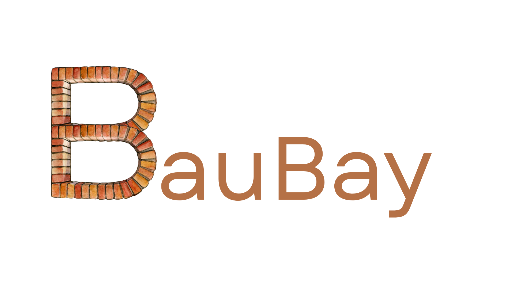

<div align="center">


# BauBay

**AI-Powered Construction Material Recovery & Marketplace Platform**


</div>

BauBay is an intelligent construction material management system that helps site managers identify, value, and trade surplus materials. By leveraging AI-powered material recognition and real-time marketplace features, BauBay promotes circular economy practices in the construction industry while reducing waste and maximizing resource recovery value.

<div align="center">

[](https://github.com/HaarisIqubal/BauBay/actions)
[](https://github.com/HaarisIqubal/BauBay)
[](LICENSE)
[](https://github.com/HaarisIqubal/BauBay/releases)

[](https://ai.google.dev/)
[](https://pytorch.org/)
[](https://oneware.ai/)
[](https://react.dev/)
[](https://www.typescriptlang.org/)
[](https://vitejs.dev/)

[](https://nodejs.org/)
[](https://github.com/HaarisIqubal/BauBay)
[](./docs/contributing.md)
[](https://github.com/HaarisIqubal/BauBay)

</div>

---

## 🌟 Key Features

### 📸 **AI Material Scanner**
- Batch scan construction materials using your camera
- **PyTorch-powered object detection** for precise material identification
- Automatic identification and categorization (Wood, Metal, Concrete, Brick, Electrical, Glass)
- AI-powered condition assessment and reusability scoring
- Instant market value estimation
- Geolocation tagging for materials
- **Custom ML model trained on ONEWare Studio AI Platform**

### 📦 **Inventory Management**
- Track all recovered materials in one dashboard
- Internal project matching to identify reuse opportunities within your organization
- Real-time sustainability metrics (CO₂ avoided, waste diverted, trees saved)
- Filter materials by category, value, and condition
- Publish materials to marketplace or keep internal

### 🛒 **Material Marketplace**
- Browse available materials from other construction sites in your region
- Distance-based search (example: Nuremberg region)
- Add items to cart and request materials
- View pickup times, access requirements, and location details
- Track material requests and approval status

### 💬 **AI Chat Assistant**
- Natural language material search
- Intelligent recommendations based on project needs
- Quick add-to-cart functionality
- Context-aware suggestions

### 📊 **Sustainability Dashboard**
- Track environmental impact with animated metrics
- Monthly CO₂ savings visualization
- Value recovery analytics
- Real-time impact reporting

### 🔔 **Smart Notifications**
- Customizable alerts for new materials
- Category-based preferences (Wood, Metal, High Value items, etc.)
- Real-time marketplace updates

---

## 🚀 Quick Start

### Prerequisites

- **Node.js** (v18 or higher)
- **Gemini API Key** from [Google AI Studio](https://ai.google.dev/)

### Installation

1. **Clone the repository**
   ```bash
   git clone https://github.com/HaarisIqubal/BauBay.git
   cd BauBay
   ```

2. **Install dependencies**
   ```bash
   npm install
   ```

3. **Configure environment**
   
   Create a `.env.local` file in the root directory:
   ```env
   VITE_GEMINI_API_KEY=your_gemini_api_key_here
   ```

4. **Run the development server**
   ```bash
   npm run dev
   ```

5. **Open your browser**
   
   Navigate to `http://localhost:5173` to see the app in action!

---

## 🏗️ Tech Stack

- **Frontend Framework:** React 19 with TypeScript
- **Build Tool:** Vite
- **AI Integration:** 
  - Google Gemini API (@google/genai) for natural language processing
  - **PyTorch ML Model** for object detection and material recognition
- **ML Training Platform:** **ONEWare Studio AI Platform**
- **Styling:** TailwindCSS (custom utility classes)
- **State Management:** React Hooks
- **Geolocation:** Browser Geolocation API
- **Image Processing:** File API with Camera integration
- **Object Detection:** Custom PyTorch model for construction materials

---

## 📁 Project Structure

```
baubay_2/
├── components/
│   ├── CartDrawer.tsx          # Shopping cart interface
│   ├── ChatAssistant.tsx       # AI-powered chat
│   ├── InventoryCard.tsx       # Material card component
│   ├── ItemDetails.tsx         # Material detail view
│   ├── NavBar.tsx              # Bottom navigation
│   ├── ProfileModal.tsx        # User profile & requests
│   └── Scanner.tsx             # Camera scanning interface
├── services/
│   └── geminiService.ts        # Gemini AI integration
├── App.tsx                     # Main application component
├── types.ts                    # TypeScript type definitions
├── index.tsx                   # Application entry point
├── vite.config.ts              # Vite configuration
└── package.json                # Dependencies & scripts
```

---

## 🎯 Use Cases

1. **Construction Site Managers**: Track surplus materials and find reuse opportunities
2. **Sustainability Officers**: Monitor environmental impact and circular economy metrics
3. **Procurement Teams**: Source cost-effective reclaimed materials from nearby sites
4. **Project Coordinators**: Match materials across multiple company projects

---

## 🌍 Environmental Impact

BauBay helps construction teams:
- **Reduce Landfill Waste** by facilitating material reuse
- **Lower Carbon Footprint** through avoided material production
- **Promote Circular Economy** in construction industry
- **Track Sustainability Metrics** for ESG reporting

---

## 🛠️ Available Scripts

- `npm run dev` - Start development server
- `npm run build` - Build for production
- `npm run preview` - Preview production build locally

---

## 📖 Documentation

Comprehensive documentation is available in the `/docs` folder:

**[📚 Documentation Index](./docs/README.md)**

### Quick Links

**Getting Started:**
- [Installation Guide](./docs/installation.md) - Setup and configuration
- [Architecture Overview](./docs/architecture.md) - System design and structure
- [Components](./docs/components.md) - Detailed component docs
- [Types Reference](./docs/types.md) - TypeScript definitions

**Development:**
- [Code Examples](./docs/reference/code-examples.md) - Common patterns and snippets
- [Troubleshooting](./docs/reference/troubleshooting.md) - Solutions to common issues

**Features:**
- [Material Scanner](./docs/features/scanner.md) - AI-powered detection (coming soon)
- [PyTorch Object Detection](./docs/features/pytorch-model.md) - ML model documentation
- [Inventory Management](./docs/features/inventory.md) - Material tracking (coming soon)
- [Marketplace](./docs/features/marketplace.md) - Material exchange (coming soon)
- [Chat Assistant](./docs/features/chat.md) - AI interface (coming soon)

---

## 🔗 Links

- **Live Demo:** [AI Studio App](https://ai.studio/apps/drive/1jjZGmtihvBCLizVR1NtmE7x7_2CGbwkQ)
- **Repository:** [github.com/HaarisIqubal/BauBay](https://github.com/HaarisIqubal/BauBay)
- **Google Gemini:** [ai.google.dev](https://ai.google.dev/)

---

## 📄 License

This project is built as part of the Google Gemini AI Studio demonstration.

---

## 🙏 Acknowledgments

- Powered by **Google Gemini AI** for intelligent natural language processing
- **PyTorch** for deep learning-based object detection
- **ONEWare Studio AI Platform** for ML model training and optimization
- Built with **React** and **Vite** for modern web development
- Inspired by circular economy principles in construction

---

**Built with ❤️ for sustainable construction practices**
